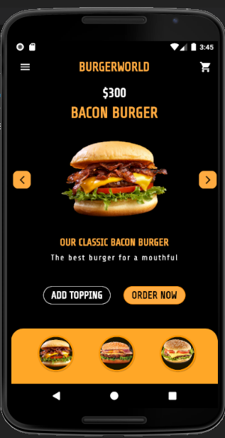
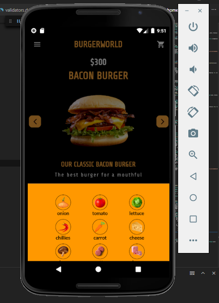
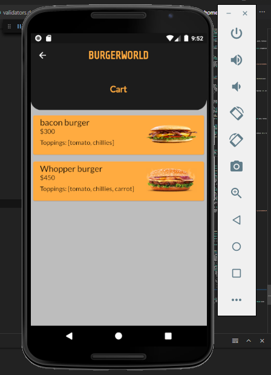
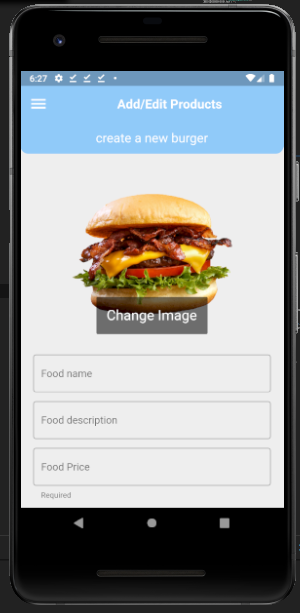
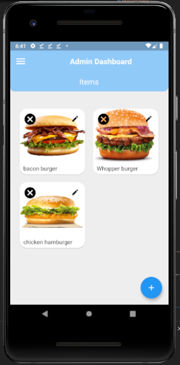
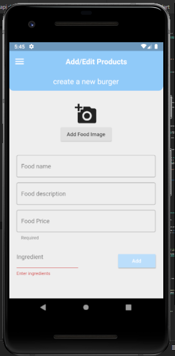

# burger_world App

## e-commerce app created in flutter

* crud operations done in the app, [burger_world_app_admin](https://github.com/vincentLovesComputers/burger-admin-app) to **create, add, update and delete products**

---
## Products are hosted in firebase database and user information like products added to cart
---

---

# CRUD  operations done on admin app, [burger_world_app_admin](https://github.com/vincentLovesComputers/burger-admin-app)

## Repo for admin app, [burger_world_app_admin](https://github.com/vincentLovesComputers/burger-admin-app)

